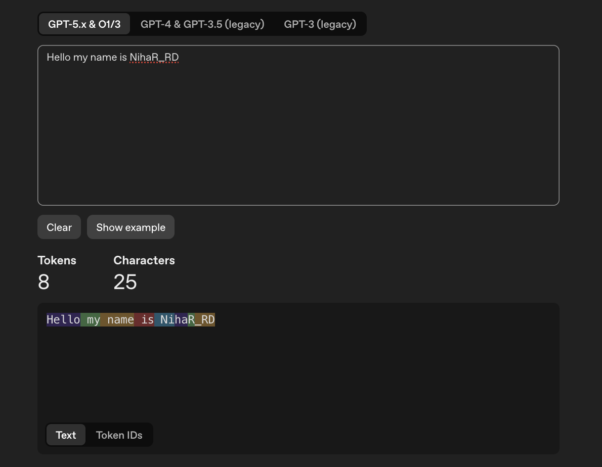

GPT or Gemini
Converts works into tokens i.e maps words with numbers.

Every GPT like OpenAI's GPT , Gemini has their own tokenization.

Converting into Tokens -> Encoding
Producing Next Token -> By Transformer
Coverting into Human Readable Text -> Decoding
