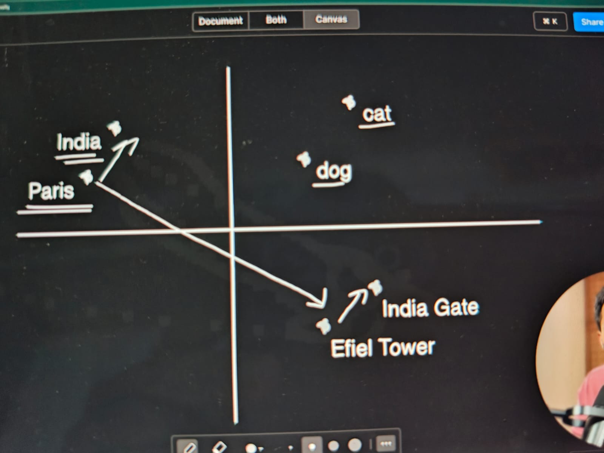

What is a Vector Embedding?
Imagine trying to explain to a computer that "dog" and "puppy" mean almost the same thing, but "dog" and "submarine" are completely different. Computers only understand math, so we have to convert those concepts into arrays of numbers called vectors.

An embedding takes complex data and maps it into a high-dimensional mathematical space. You can think of it as a massive, invisible universe of concepts. In this space, things that share semantic similarity are placed physically closer together.

"Apple" and "Orange" would be clustered together in the "fruit" neighborhood.

"Car" and "Bus" would be in the "vehicle" neighborhood.

"King" and "Queen" would have the exact same spatial relationship (distance and direction) as "Man" and "Woman."

True Semantic Understanding: Instead of just looking for exact keyword matches, embeddings allow GenAI to grasp underlying intent. If you ask about "fixing a display," the AI knows you are likely talking about a phone or monitor, not a museum exhibit, based on the vector relationships of the surrounding words.

The line between India and Paris and Efiel Tower and India Gate makes same angle with the horizonatal.
